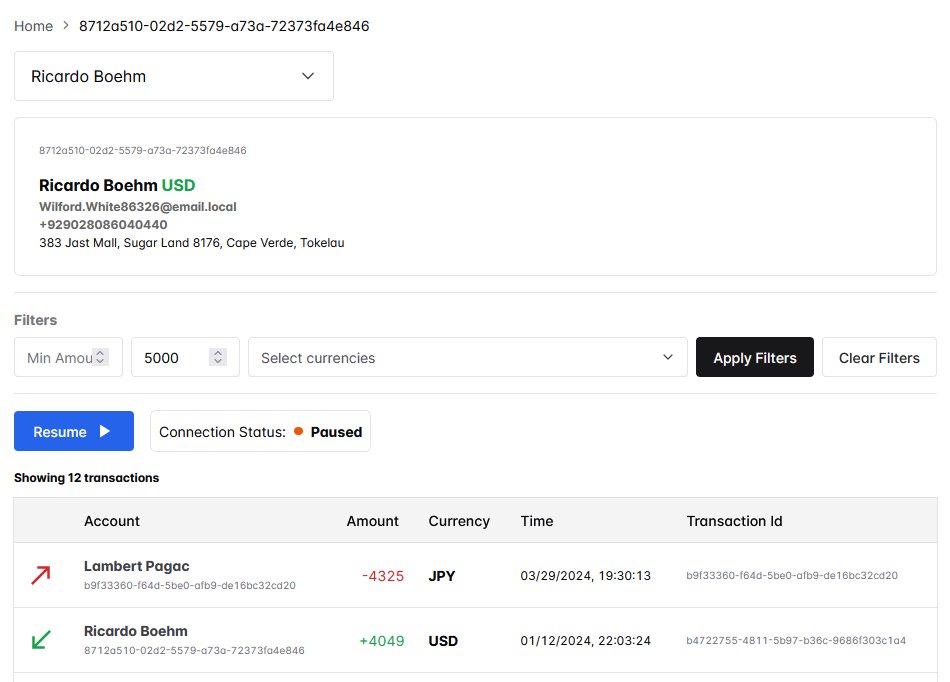

# Financial Monitoring :dollar:

### _The NextJS financial transactions monitoring system_

**by** [](http://fior.in)

## .: Frontend :.

#### Click [here to see the preview](public/preview.png)


The project was conceived as simple monitoring system for a emulated transaction flow.

The following technologies were used in the frontend development:

| What?       | For what?              |
| ----------- | ---------------------- |
| Next.js     | Front-end structure.   |
| Npm         | Dependency management. |
| Typescript  | Language used.         |
| ChackraUI   | Components lib.        |
| React-icons | Icon library.          |

### Execution requirements

- Node.js
- Npm

To prepare the environment and run the application, run the commands:

```sh
$ npm install
$ npm run build
$ npm run start
```

The application will be available at:

```sh
http://localhost:3000
```

### Or running the development mode

To run the application in the dev mode, run the commands:

```sh
$ npm install
$ npm run dev
```

**by** [](http://fior.in)

---

#### Useful links

- [Next.js](https://nextjs.org/)
- [ChackraUI](https://www.chakra-ui.com)
- [React Icons](https://react-icons.github.io/react-icons/)
